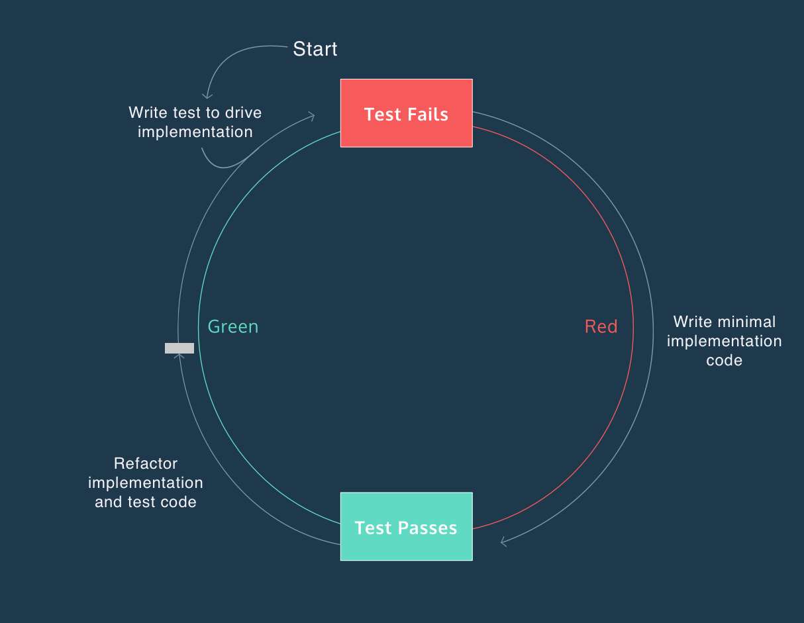

# From Tests to Source Code

### Learning Objectives
- Use tests to write source code
- Explain the cycle of TDD and what is meant by Red, Green, Refactor

### Intro



Your teacher will demonstrate the **Red, Green, Refactor** loop by watching the tests fail and then writing source code to make the tests pass.

```js
// TEST CODE
// spec/cohortSearch.spec.js
const cohortSearch = require('../src/cohortSearch.js')

describe("Cohort Search", () => {
  it("returns cohort name if found", () => {
    // setup
    const cohortList = ["class 1", "class 2"]
    // execute
    const result = cohortSearch.searchByCohortName(cohortList, "class 1")
    // verify
    expect(result).toEqual(true)
  })

  it("returns cohort name if not found", () => {
    // setup
    const cohortList = ["class 1", "class 2"]
    // execute
    const result = cohortSearch.searchByCohortName(cohortList, "class 3")
    // verify
    expect(result).toEqual(false)
  })
})
```

```js
// SOURCE CODE
// src/cohortSearch.js

const cohortSearch = (list, name) => {
 // to be implemented
}

module.exports = cohortSearch
```

### Instructions

Methods | Inputs | Data | Scenario | Outputs
------ | ------ | ------ | ----- | -----
totalCost(basket) | basket(@Item[]) | Item(@Object), properties: _name(@String), price(@Number), quantity(@Number))_ | If there are items | @Number
| | |If no items | @Number (0)
createReceipt(basket) | basket(@Item[]) | Item(@Object), properties: _name(@String), price(@Number), quantity(@Number))_ | If there are items | @String
| | |If no items | @String

- [ ] Use the tests based on the above domain model
- [ ] Run your tests and watch them fail (Red)
- [ ] Make the tests pass as simply and quickly as you can (Green)
- [ ] Take the opportunity to make your code better (Refactor)
- [ ] Don't forget to lint your code

### Further
- [ ] Create your own test framework - no 3rd party packages allowed.
- [ ] Use a test coverage tool to report on % of lines of code executed by your test suite.

### [Linting Code](https://stackoverflow.com/questions/8503559/what-is-linting)

The project has [eslint](https://eslint.org/docs/user-guide/getting-started) as a development dependency, configured with [Standard](https://betterprogramming.pub/comparing-the-top-three-style-guides-and-setting-them-up-with-eslint-98ea0d2fc5b7) style to use so you can lint your code
```sh
$ npx eslint src
$ npx eslint src --fix  # to auto-fix problems
```
